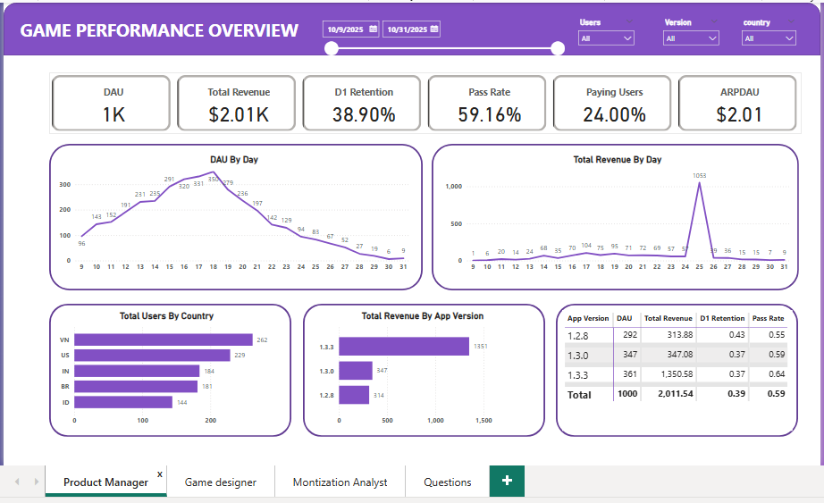
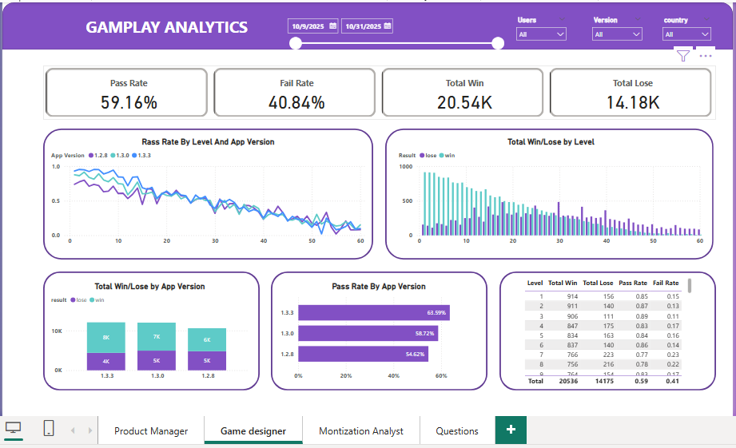
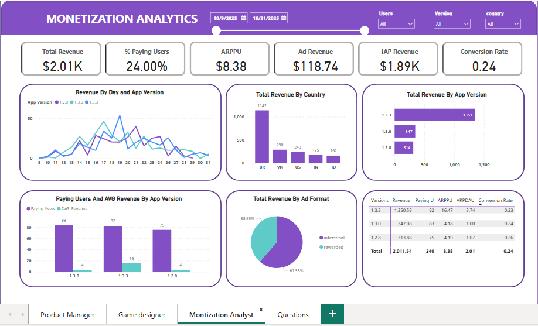

# 🎮 Mobile Game Analytics Dashboard

An end-to-end **Game Data Analytics** project that analyzes player behavior, gameplay performance, retention, and monetization using **Python, PostgreSQL, SQL, and Power BI**.

The project transforms raw game event logs into actionable business insights to help improve player retention, optimize game difficulty, and maximize revenue.

---

# 📌 Business Problem

A mobile puzzle game company wants to better understand player behavior in order to improve user experience, increase player retention, and maximize revenue.

The management team suspects that different app versions may significantly impact player progression, retention, and spending behavior. Therefore, this project aims to analyze gameplay data, evaluate key business KPIs, and provide data-driven recommendations for product improvement.

---

# 🎯 Project Objectives

This project aims to answer the following business questions:

- Which app version has the largest player base?
- Which app version generates the highest revenue?
- Which app version has the highest Lifetime Value (LTV)?
- What are the Day 1 (D1) and Day 7 (D7) retention rates?
- Which game levels are the most difficult?
- What is the overall level completion rate?
- What is the payer conversion rate?
- What is the Average Revenue Per Paying User (ARPPU)?
- Which countries generate the highest revenue?

---

# 🛠 Tech Stack

- **Python**
  - Pandas
  - NumPy

- **Database**
  - PostgreSQL

- **SQL**
  - Aggregation
  - CTE
  - Window Functions
  - Business KPI Analysis

- **Visualization**
  - Power BI

---

# 📂 Dataset

The dataset contains **85,008 game events** collected from a mobile puzzle game.

### Dataset Features

| Column | Description |
|---------|-------------|
| user_id | Unique player identifier |
| event_time_utc | Event timestamp |
| app_version | Game version |
| country | Player country |
| event_name | Event type |
| level | Current level |
| result | Win / Lose |
| booster_used | Booster usage |
| ad_format | Advertisement format |
| ad_revenue_usd | Ads revenue |
| iap_revenue_usd | In-App Purchase revenue |

### Event Types

- first_open
- level_start
- booster_use
- level_end
- ad_impression
- iap_purchase

---

# 🔄 Project Workflow

```text
Business Problem
        │
        ▼
Raw Dataset (Excel)
        │
        ▼
Python
Data Cleaning & EDA
        │
        ▼
PostgreSQL
        │
        ▼
SQL Analysis
        │
        ▼
Power BI Dashboard
        │
        ▼
Business Insights
        │
        ▼
Business Recommendations
```

---

# 🧹 Data Preparation (Python)

The dataset was cleaned and prepared using Python.

Main tasks included:

- Import dataset
- Inspect data types
- Generate descriptive statistics
- Handle missing values
- Check duplicate records
- Explore categorical variables
- Convert timestamps into datetime
- Perform feature engineering
- Export cleaned data into PostgreSQL

---

# 📊 SQL Analysis

SQL was used to calculate business KPIs and answer key business questions.

Topics covered include:

- Player Distribution
- Revenue Analysis
- Lifetime Value (LTV)
- D1 Retention
- D7 Retention
- Level Completion Rate
- Win Rate
- Payer Conversion Rate
- ARPPU
- Level Difficulty Analysis

---

# 📈 Power BI Dashboard

The dashboard consists of three interactive pages.

## Executive Overview

Shows high-level business KPIs including:

- Total Players
- Total Revenue
- D1 Retention
- D7 Retention
- Payer Rate
- ARPPU
- Revenue Trend
- Player Distribution
- App Version Comparison



---

## Gameplay Analytics

Provides insights into player progression and game balance.

Includes:

- Pass Rate by Level
- Win vs Lose Distribution
- Booster Usage
- Level Difficulty
- Gameplay Funnel



---

## Monetization Analytics

Focuses on revenue generation.

Includes:

- Ads Revenue
- IAP Revenue
- Revenue by Country
- Revenue by App Version
- Revenue Trend



---

# 💡 Key Business Insights

### 🎯 Player Retention

- D1 Retention is only **38.9%**
- More than 60% of players leave after their first day.
- The onboarding experience should be improved.

---

### 🎯 Gameplay

- Overall Pass Rate is **59%**
- Difficulty increases sharply after **Level 50**.
- Level 55 has only an **8% pass rate**, indicating excessive difficulty.

---

### 🎯 Monetization

- Total Revenue: **$2,011**
- IAP Revenue: **$1,892 (94%)**
- Ads Revenue: **$119 (6%)**

The game relies heavily on In-App Purchases.

---

### 🎯 Market Performance

Brazil generated the highest total revenue, indicating strong monetization potential in this region.

---

# 🚀 Business Recommendations

- Improve the onboarding experience to increase D1 Retention.
- Rebalance Levels 45–60 to reduce player frustration.
- Offer free boosters or gameplay hints for difficult levels.
- Conduct cohort analysis to better understand paying users.
- Introduce additional mid-priced IAP packages.
- Continue optimizing Version 1.3.3, which remained the best-performing release after excluding the VIP player's $999 purchase.

---

# 📁 Repository Structure

```text
Mobile-Game-Analytics/
│
├── business-problem/
│   └── Business Problem.pdf
│
├── dataset/
│   └── DatasetOfficial.xlsx
│
├── python/
│   └── EDA_game.ipynb
│
├── sql/
│   └── SQL Business Questions.sql
│
├── powerbi/
│   └── GameDashboard.pbix
│
├── slides/
│   └── Mobile-Game-Analytics-Dashboard.pdf
│
├── images/
│   ├── overview.PNG
│   ├── gameplay.PNG
│   └── monetization.PNG
│
├── Summary GameApp Analytics.pdf
├── LICENSE
└── README.md
```

---

# 🎓 Skills Demonstrated

- Data Cleaning
- Exploratory Data Analysis (EDA)
- Feature Engineering
- SQL
- PostgreSQL
- Business Analytics
- KPI Design
- Retention Analysis
- Funnel Analysis
- Monetization Analysis
- Dashboard Design
- Power BI
- Data Storytelling
- Business Recommendation

---

# 📄 Project Summary

A complete report describing the project methodology, analysis process, business insights, and recommendations is available in:

**📘 Summary GameApp Analytics.pdf**

---

# 👤 Author

**Nguyen Xuan Hop**

Aspiring Data Analyst | SQL | Python | Power BI | PostgreSQL

If you found this project interesting, feel free to ⭐ this repository or connect with me on LinkedIn.
